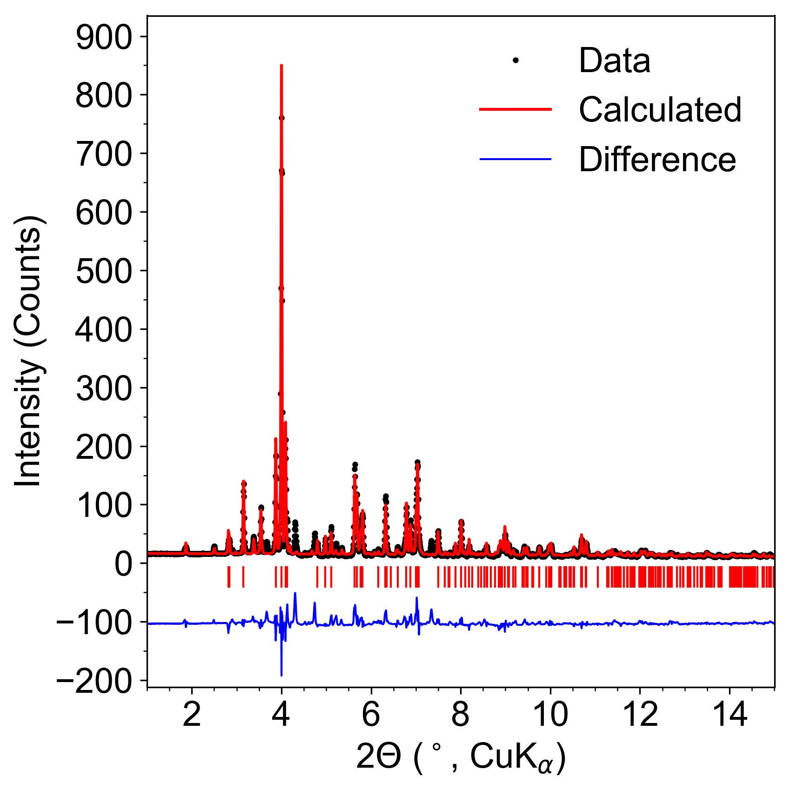
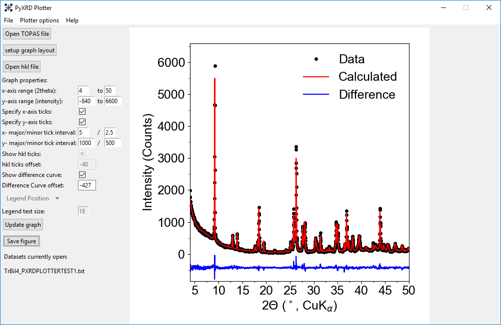

# PyXRD-Plotter V. 0.6
A simple piece of software that makes graphing of Powder X-ray Diffraction Reitveld refinement data quick and easy.

Powder diffraction data can be difficult to accurately and elegantly display. This is especially true when attempting to plot all apsects of a Reitveld refined dataset, such as the difference curve, experimental data + fit data, and then hkl tick marks to indicate locations of expected Bragg reflections. This highly specific way of showing data makes plotting PXRD data time consuming and frustrating using typical graphing software.

PyXRD-Plotter was made specifially to alleviate the afformentioned difficulties of graphing PXRD data in a simple yet aesthetically pleasing manner. It is written in Python 3 using TKinter to generate the GUI and graphical elements generated using the MatPlotLib package. The code has an algorithm to determine which data are included in the file (as topas can export a multitude of different columns of data) and figures out which are which - i.e. difference curve, x-axis (2theta) data, calculated curves, raw data, and more without any input from the user.

It then looks at the raw data in the file and attempts to plot the data in publication quality without any modification - of course there are options to modify the plot if necessary.

Example of a Reitveld refinement dataset plotted simply by loading in the data:

Example of the gui as is:

<b>How to use:</b>

<b>Loading in data</b>
1. Complete a Reitveld refinement in TOPAS to your liking. 
2. Right click the data set you want to export, and select "Export diff, I,"; save as a .txt file. do not modify this file.
3. (optional) to also load in hkl ticks: go to the refined model you want hkl ticks for. click "hkl_ls". highlight the "2theta" column, right-click and select "copy all", and paste into a text file and save as a .txt.
4. Open PXRD-Plotter and click "load TOPAS file". Navigate to the unmodified exported TOPAS .txt file you generated and open. The graph will immediately be populated with the data.
5. (optional) Click "load hkl ticks" to load in hkl ticks. Navigate to the .txt file you saved the hkl ticks in and open. the graph will automatically populate the ticks. This step can be repeated if multiple hkl tick files are necessary, such as when multiple phases exist.

<b>Tweaking your graph</b>

The loaded in data will automatically populate the properties on the lefthand side based on the algorithm's calculation to most accurately display the data. These should be considered starting points when modifying these values further.

<b>Note: Any changes require clicking the "update graph" button.</b>

1. To modify x or y range, simply specify the values you want in the entry boxes provided. 
2. To turn on specific tick mark styles, check the x or y (or both) boxes to modify the tick spacing.
3. (optional) If you have hkl ticks to load in, you can turn them on or off, as well as modify they location relative to the data by changing the entry value.
2. To disable the difference curve, check "disable difference curve"
3. To move the difference curve (to avoid having too much whitespace or overlapping with the data curve), specify a value in the entry box. Use negative values to move the curve lower.
4. To set one of the 3 specific template layouts, click "Setup graph layout" button and select the type desired. (not working yet)

<b>Saving your graph as an image</b>
1. Click "save graph" button. Currently supports exporting as .png file.
2. Figure will be trimmed to make sure there is no extra whitespace on the margins.

<b>misc notes:</b>

File format that are currently accepted are text files containing unmodified TOPAS exported data (for difference, data, and fit curves), and then hkl-containing text files.

<b>Version changes: 0.6:</b>

1. Added error handling to data importing/plotting.
2. Changed how ticks are drawn; no longer using the "|" character, rather it draws the lines instead.
3. Allow for modifying tick lengths.
4. Fixed the initial data importing to graph correctly when hkl files are imported.
5. Moved dataset manager from the main frame to a separate frame, as this box could get quite long with more datasets + hkl files imported.
6. Added compress difference curve function to allow for compressing or enlarging curve. This is mainly here for aestethics.

<b>Version 0.7 will include:</b>

1. Make modify x- and y-axis label function work.
2. Fix dataset manager window to allow users to turn on off datasets/hkl ticks.
3. constrain graph size; currently subtle changes happen to the axis lengths when modifying ticks or labels. Want it to be consistent.
